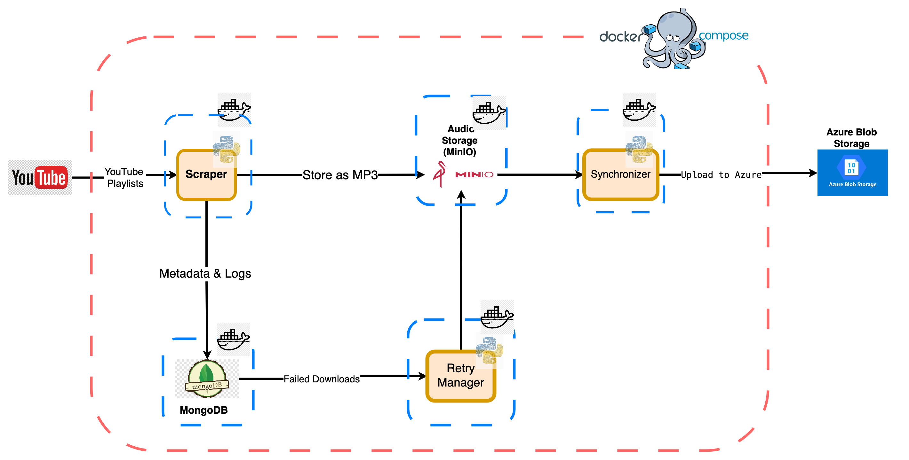

# Youtube-Fon-Scrapping

## Présentation du projet
Ce projet a pour objectif de scraper des vidéos YouTube à partir de playlists, d’extraire leur audio au format MP3, de stocker les métadonnées et logs dans MongoDB, et d’uploader les fichiers audio dans MinIO. Il intègre également un système de retry automatique pour les téléchargements échoués et une architecture modulaire facilement extensible. Une synchronisation vers Azure Blob Storage est également possible.


## Schéma d'architecture et interprétation


Le pipeline est orchestré par Docker Compose et se compose des modules suivants, chacun correspondant à un service distinct :

- **Scraper** : Extrait les playlists YouTube, télécharge les vidéos, extrait l’audio en MP3 et stocke les fichiers audio dans **Audio Storage (MinIO)**. Il enregistre également les métadonnées et logs dans **MongoDB**.
- **Retry Manager** : Gère automatiquement la reprise des téléchargements échoués. Il surveille les logs dans **MongoDB** et relance le Scraper pour les vidéos en échec.
- **Audio Storage (MinIO)** : Stocke tous les fichiers audio extraits au format MP3. Sert de stockage intermédiaire compatible S3.
- **Synchronizer** : Synchronise les fichiers audio présents dans MinIO vers **Azure Blob Storage** pour une sauvegarde cloud ou une distribution externe.
- **MongoDB** : Base de données pour stocker les logs détaillés et les métadonnées de chaque vidéo traitée.
- **Azure Blob Storage** : Stockage cloud final pour les fichiers audio synchronisés.

### Flux de données principaux
- **Store as MP3** : Les fichiers audio extraits par le Scraper sont stockés dans MinIO.
- **Metadata & Logs** : Toutes les informations de traitement (succès, échecs, détails vidéo) sont enregistrées dans MongoDB.
- **Failed Downloads** : Les échecs de téléchargement sont transmis au Retry Manager pour une nouvelle tentative.
- **Upload to Azure** : Les fichiers audio stockés dans MinIO sont synchronisés vers Azure Blob Storage par le Synchronizer.

L’ensemble de ces interactions est illustré dans le schéma Mermaid du fichier `architecture.md`.

## Architecture et composants
- **scraper.py** : Script principal orchestrant le scraping, l’extraction audio, l’insertion des logs et métadonnées, et l’upload MinIO (Scraper).
- **mongo_utils.py** : Fonctions utilitaires pour l’insertion des logs et métadonnées dans MongoDB, et la vérification d’existence des vidéos.
- **minio_utils.py** : Fonctions pour l’upload des fichiers audio dans MinIO et la vérification de disponibilité.
- **retry_failed.py** : Script autonome pour relancer automatiquement les téléchargements ayant échoué (Retry Manager, basé sur les logs MongoDB).
- **azure_sync.py** : Script pour synchroniser les fichiers MinIO vers Azure Blob Storage, lister les blobs et obtenir des statistiques (Synchronizer).
- **playlist.txt** : Liste des playlists YouTube à traiter (une par ligne, URL ou ID).
- **requirements.txt** : Dépendances Python nécessaires.
- **Dockerfile** : Image Docker pour exécuter l’ensemble du pipeline.
- **docker-compose.yml** : Orchestration des services (MongoDB, MinIO, scripts Python).
- **.env** : Variables d’environnement sensibles (API keys, accès Mongo, MinIO, Azure, etc.).

## Structure des dossiers

```
.
├── scraper.py
├── mongo_utils.py
├── minio_utils.py
├── retry_failed.py
├── azure_sync.py
├── playlist.txt
├── requirements.txt
├── Dockerfile
├── docker-compose.yml
├── .env.example
├── audios/                # Dossier de sortie des fichiers MP3
└── logs/                  # Logs d’exécution (optionnel)
```

## Fonctionnalités principales
- **Scraping massif** de playlists YouTube (multi-playlist, multi-thread).
- **Extraction audio** en MP3 320kbps via SaveTube ou yt-dlp (fallback).
- **Stockage des logs** et métadonnées dans MongoDB.
- **Upload automatique** des fichiers audio dans MinIO (compatible S3).
- **Synchronisation optionnelle** des fichiers audio vers Azure Blob Storage.
- **Retry automatique** des téléchargements échoués.
- **Gestion avancée des erreurs** et logs détaillés.

## Données enregistrées dans MongoDB
- **logs** : chaque tentative de téléchargement (succès ou échec) est enregistrée avec :
  - `video_id`, `url`, `title`, `status` (success/failed), `timestamp`, `retry_attempts`, `last_retry`, message d’erreur éventuel.
- **métadonnées vidéos** : informations détaillées sur chaque vidéo traitée (titre, auteur, durée, etc.).
- Ces données permettent un suivi précis, la relance automatique des échecs, et des statistiques sur le pipeline.

## Utilisation des scripts principaux

### 1. scraper.py
Script principal pour le scraping, extraction audio, upload MinIO et insertion MongoDB.

```bash
python3 scraper.py
```

### 2. retry_failed.py
Relance automatiquement les téléchargements ayant échoué (statut "failed" dans MongoDB). Boucle infinie avec attente entre chaque scan.

```bash
python3 retry_failed.py
```
- Fonctionnement :
  - Récupère les entrées échouées dans la collection MongoDB.
  - Relance le téléchargement pour chaque vidéo.
  - Met à jour le statut, le nombre de tentatives (`retry_attempts`) et le timestamp (`last_retry`).
  - Les logs sont enregistrés dans `youtube_retry_download.log`.

### 3. azure_sync.py
Permet de synchroniser tous les fichiers audio présents dans MinIO vers Azure Blob Storage, ou de lister les blobs et obtenir des statistiques.

#### Variables d’environnement nécessaires :
- `MINIO_ENDPOINT`, `MINIO_ACCESS_KEY`, `MINIO_SECRET_KEY`, `MINIO_BUCKET`
- `AZURE_ACCOUNT_URL`, `AZURE_SAS_TOKEN`, `AZURE_CONTAINER`

#### Exemples d’utilisation :
- Synchroniser MinIO → Azure :
  ```bash
  python3 azure_sync.py
  ```
- Lister les blobs Azure :
  ```bash
  python3 azure_sync.py --list
  ```
- Afficher les statistiques de stockage Azure :
  ```bash
  python3 azure_sync.py --stats
  ```
- Les logs sont enregistrés dans `azure_sync.log`.

#### Fonctionnement :
- **sync_to_azure** : parcourt tous les objets du bucket MinIO et les upload dans Azure Blob Storage (avec métadonnées).
- **list_azure_blobs** : liste tous les blobs présents dans le conteneur Azure, affiche nom, taille, date, métadonnées, et statistiques globales.

## Exécution dans des conteneurs séparés
Chaque script peut être exécuté dans un conteneur dédié pour une meilleure isolation et scalabilité. Exemple de configuration dans `docker-compose.yml` :

```yaml
services:
  scraper:
    build: .
    command: python3 scraper.py
    env_file: .env
    depends_on:
      - mongo
      - minio

  retry:
    build: .
    command: python3 retry_failed.py
    env_file: .env
    depends_on:
      - mongo
      - minio

  azure_sync:
    build: .
    command: python3 azure_sync.py
    env_file: .env
    depends_on:
      - minio
      - azure

  mongo:
    image: mongo:latest
    ports:
      - "27017:27017"
    volumes:
      - ./data/mongo:/data/db

  minio:
    image: minio/minio
    environment:
      MINIO_ACCESS_KEY: ${MINIO_ACCESS_KEY}
      MINIO_SECRET_KEY: ${MINIO_SECRET_KEY}
    command: server /data
    ports:
      - "9000:9000"
    volumes:
      - ./data/minio:/data

  azure:
    image: mcr.microsoft.com/azure-storage/azurite
    ports:
      - "10000:10000"
```

## Installation

### Prérequis
- Docker & Docker Compose
- Clé API YouTube valide
- Accès à un serveur MinIO (ou S3 compatible)
- Accès à un compte Azure Blob Storage (optionnel)

### Étapes
1. Copier `.env.example` en `.env` et compléter toutes les variables nécessaires (API, Mongo, MinIO, Azure).
2. Ajouter vos playlists dans `playlist.txt` (une par ligne, format URL ou ID).
3. Construire et lancer les services :
   ```bash
   docker-compose up --build
   ```
4. Les logs seront insérés dans MongoDB et les fichiers audio uploadés dans MinIO automatiquement. La synchronisation vers Azure peut être lancée à la demande.

## Conseils de maintenance et extension
- Pour ajouter de nouvelles playlists, éditez simplement `playlist.txt`.
- Pour changer la logique d’extraction ou d’upload, modifiez les modules dédiés (`scraper.py`, `minio_utils.py`).
- Pour intégrer d’autres services cloud (Azure, AWS S3…), adaptez `minio_utils.py` ou ajoutez de nouveaux modules.
- Les logs détaillés facilitent le debug et le suivi des traitements.

## Exemples de commandes utiles
- Lancer tous les services :
  ```bash
  docker-compose up --build
  ```
- Arrêter les services :
  ```bash
  docker-compose down
  ```
- Nettoyer les fichiers audio locaux :
  ```bash
  rm -rf audios/*
  ```

## Contribution
Les contributions sont les bienvenues ! Merci de proposer une issue ou une pull request pour toute amélioration ou correction.

## Licence
Projet open-source sous licence MIT.