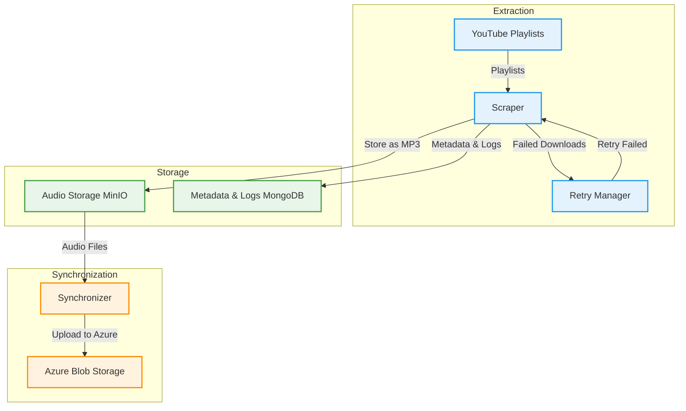

# Project Architecture Diagram - Youtube-Fon-Scrapping

```mermaid
graph TD
    %% Extraction Layer
    YT[YouTube Playlists]
    SCR[Scraper]
    RETRY[Retry Manager]

    %% Storage Layer
    MINIO[Audio Storage MinIO]
    MONGO[Metadata & Logs MongoDB]

    %% Synchronization Layer
    SYNC[Synchronizer]
    AZURE[Azure Blob Storage]

    %% Data Flows
    YT -- "Playlists" --> SCR
    SCR -- "Store as MP3" --> MINIO
    SCR -- "Metadata & Logs" --> MONGO
    SCR -- "Failed Downloads" --> RETRY
    RETRY -- "Retry Failed" --> SCR
    MINIO -- "Audio Files" --> SYNC
    SYNC -- "Upload to Azure" --> AZURE

    %% Groupings
    subgraph Extraction
        YT
        SCR
        RETRY
    end
    subgraph Storage
        MINIO
        MONGO
    end
    subgraph Synchronization
        SYNC
        AZURE
    end

    %% Legend
    classDef extraction fill:#e3f2fd,stroke:#2196f3,stroke-width:2px;
    classDef storage fill:#e8f5e9,stroke:#43a047,stroke-width:2px;
    classDef sync fill:#fff3e0,stroke:#fb8c00,stroke-width:2px;
    class YT,SCR,RETRY extraction;
    class MINIO,MONGO storage;
    class SYNC,AZURE sync;

```

This diagram illustrates the main interactions between the extraction, storage, and synchronization components.